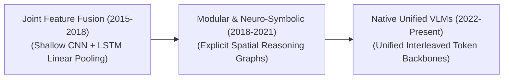

# Awesome-Visual-Question-Answering
## Visual Question Answering (VQA): Evolution, Variants, Types, & Applications

Visual Question Answering (VQA) is a core multimodal computer vision and natural language processing paradigm where an AI system must provide a correct natural language answer to an open-ended question based on a given input image. VQA transitions machine perception from isolated task heads (like simple object classification or object bounding) to dynamic, human-like conceptual reasoning. To succeed, a VQA engine must simultaneously parse the visual geometry of a scene, interpret the linguistic intent of a question, extract semantic spatial relationships, and frequently cross-reference the input with external world knowledge.

---

## 1. The Chronological Evolution

The technical implementation of visual reasoning has transitioned from rigid, shallow feature fusions to modular reasoning networks, moving toward native unified multi-modal autoencoding foundations.

| Era | Concept & Limitations | Year First Used | Pioneering Paper |
| :--- | :--- | :---: | :--- |
| **The Joint Feature Fusion Era (~2015–2018)** | **Concept:** The structural baseline. Extracted global image vectors using a Convolutional Neural Network (CNN) and processed text questions via a Recurrent Neural Network (LSTM). The separate feature arrays were fused using basic linear combinations—such as concatenation, element-wise multiplication, or **Bilinear Pooling**—and passed to a multi-class softmax classification head over a fixed set of popular answers.  **Limitation:** Suffered heavily from **Language Bias** (e.g., answering "yellow" to the question "What color is the banana?" without actually looking at the pixels because the dataset was skewed). | 2015 | [Antol et al. (ICCV 2015)](https://arxiv.org/abs/1505.00468) |
| **The Modular & Neuro-Symbolic Era (~2018–2021)** | **Concept:** Addressed multi-step logic gaps. Introduced **Neural Module Networks (NMNs)** and attention-driven **Scene Graphs**. A question was parsed into a sequence of functional sub-tasks (e.g., `find(large_box) -> filter(blue) -> count()`), and specialized neural modules executed the spatial operations step-by-step over localized object regions.  **Limitation:** Highly fragile; if the text parser misidentified the question logic, the downstream visual execution chain collapsed entirely. | 2018 | [Yi et al. (NeurIPS 2018)](https://arxiv.org/abs/1810.02338) |
| **The Native Unified Generative VLM Era (~2022–Present)** | **Concept:** The modern state-of-the-art frontier standard. Popularized by architectures like **LLaVA**, **BLIP-2**, and unified foundation cores (such as **GPT-4o** or **Gemini 1.5**). Images are sliced into structural patches (patchified) and converted via projection layers into virtual visual tokens. These are interleaved natively with text character tokens inside a massive autoregressive Transformer core, predicting answers token-by-token. | 2022 | [Alayrac et al. (NeurIPS 2022)](https://arxiv.org/abs/2204.14198) |

---

## 2. Core Functional & Task Variants

VQA systems are explicitly categorized based on the underlying reasoning structure required to answer a question.

| Variant | Functional Task & Behavior | Year First Used | Pioneering Paper |
| :--- | :--- | :---: | :--- |
| **Open-Ended VQA** | **Task:** Free-Form Generation.  **Behavior:** The model treats generation like natural dialogue, outputting full sentence answers (e.g., Question: `"Why is the road wet?"` $\rightarrow$ Answer: `"Because it recently rained and there is a puddle reflecting the streetlight"`). | 2014 | [Malinowski & Fritz (NIPS 2014)](https://arxiv.org/abs/1410.0210) |
| **Multiple-Choice VQA** | **Task:** Discriminative Options Selection.  **Behavior:** Restricts the model output layer to evaluate a specific, pre-defined set of candidate answers, choosing the option with the highest logit probability map. | 2015 | [Antol et al. (ICCV 2015)](https://arxiv.org/abs/1505.00468) |
| **Knowledge-Based / Outside-Knowledge VQA (OK-VQA)** | **Task:** Multi-Source External Retrieval.  **Behavior:** The question cannot be answered purely by reading the pixels; it demands external common-sense or encyclopedic facts.  **Example:** Question: `"Is the vehicle parked in this image allowed to drive here on a Sunday in this city?"` The model must identify the vehicle type, read local parking signs, and cross-reference municipal traffic regulations. | 2019 | [Marino et al. (CVPR 2019)](https://arxiv.org/abs/1906.00067) |

---

## 3. Structural Evaluation Space Modalities

Depending on the underlying layout constraints of the target document or visual stream, VQA engines deploy specialized internal processing front-ends.

| Modality | Input Domain & Focus | Year First Used | Pioneering Paper |
| :--- | :--- | :---: | :--- |
| **Standard Scene VQA** | **Input Domain:** Natural, real-world photography (e.g., rooms, streets, landscapes).  **Focus:** Grounding object traits, counting entities, mapping relative distances, and resolving 3D spatial orientations (e.g., `"What is sitting directly behind the laptop?"`). | 2015 | [Antol et al. (ICCV 2015)](https://arxiv.org/abs/1505.00468) |
| **Document VQA (DocVQA)** | **Input Domain:** Text-dense multi-column PDFs, corporate financial receipts, or multi-axis charts.  **Focus:** Integrates Visual Character Recognition (OCR) grids with structural bounding-box attention, reading tiny layout fonts and parsing numerical values across complex matrices. | 2021 | [Mathew et al. (WACV 2021)](https://arxiv.org/abs/2007.00398) |
| **Video Question Answering (VideoQA)** | **Input Domain:** Continuous multi-frame video clips or live streams.  **Focus:** Ingests spatio-temporal token cubes to track chronology, continuous motion trajectories, and cause-and-effect events over time (e.g., `"What caused the glass on the table to fall over at the 12-second mark?"`). | 2016 | [Tapaswi et al. (CVPR 2016)](https://arxiv.org/abs/1512.02902) |

---

## 4. Production Engineering Challenges & Mitigations

Deploying high-throughput VQA frameworks inside enterprise production stacks introduces severe prompt-budget inflation and object hallucination penalties.

| Challenge | Problem Description & Mitigation | Year First Used | Pioneering Paper |
| :--- | :--- | :---: | :--- |
| **The Spatial Resolution Blur Bottleneck** | **The Problem:** Traditional vision encoders downsample images to a small fixed size (e.g., $224 \times 224$ pixels). When a user asks a fine-grained question about a small detail (such as reading a barcode label or checking a tiny serial number on an industrial pipe), the model fails because the detail was completely blurred out during tokenization.  **Mitigation:** Implementing **Dynamic Resolution Patching (AnyRes / Megapixel Partitioning)**. Massive high-res images are sliced into multiple localized standard patches alongside a global thumbnail, processing them concurrently to protect pixel integrity. | 2024 | [LLaVA Team (LLaVA-NeXT, 2024)](https://llava-vl.github.io/blog/2024-01-30-llava-next/) |
| **Object Hallucination & Yes-Bias** | **The Problem:** Generative VQA models are highly susceptible to "object hallucination"—inventing elements that do not exist in the scene due to the language model's aggressive text-completion bias overriding the actual pixel inputs. They also show a strong historical tendency to answer "Yes" to leading questions.  **Mitigation:** Injecting specialized preference optimization layers like **POPE (Polling-based Object Probing Evaluation)** metrics or **VLM-RLHF** to heavily penalize models that fail to ground text tokens to exact physical coordinate boundaries during validation checks. | 2023 | [Li et al. (EMNLP 2023)](https://arxiv.org/abs/2305.10355) |

---

## 5. Frontier Real-World Applications

| Application | Description & Use Case | Year First Used | Pioneering Paper |
| :--- | :--- | :---: | :--- |
| **Enterprise GUI & Multi-Modal Document Auditing Agents** | **Application:** Processes millions of complex invoice sheets, blueprint schematics, and financial spreadsheets daily. Business operations query the VLM agent via open-ended VQA tasks (e.g., `"Does the total listed in column C match the summation of lines 14 through 20?"`) to automate regulatory auditing instantly. | 2024 | [Koh et al. (ACL 2024)](https://arxiv.org/abs/2404.05955) |
| **Assistive Vision Technology for the Visually Impaired** | **Application:** Deployed inside smart wearable spectacles or mobile software apps. Visually impaired users navigate physical surroundings by asking continuous, real-time vocal questions (e.g., `"Is this medicine bottle the 50mg dose or the 100mg dose?"`), and the VQA chip reads and interprets the objects out loud. | 2018 | [Gurari et al. (CVPR 2018)](https://arxiv.org/abs/1802.08218) |
| **Autonomous Edge Robotics & Industrial Inspection** | **Application:** Drives quality control pipelines on factory assembly lines. Automated camera arms scan completed products, and the system evaluates compliance via automated diagnostic VQA routines (e.g., `"Are all six copper pins fully seated inside the connector plug grid?"`), halting the conveyor belt if a structural deviation is identified. | 2023 | [Sermanet et al. (ICRA 2024)](https://arxiv.org/abs/2311.00926) |

<!-- awesome link check -->
