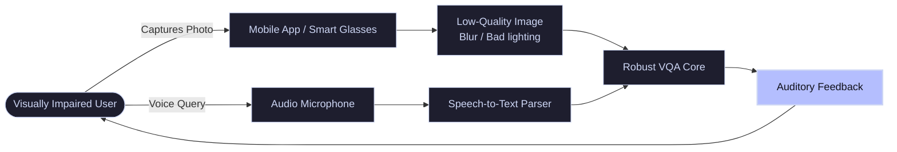

# Assistive Vision Technology

VQA is a critical tool for assisting visually impaired individuals. Users navigate their physical environment by capturing photos and asking real-time natural language questions, which the model processes to produce text-to-speech feedback.

---

## 🏛️ Assistive VQA Pipeline

The user captures an image and speaks a question. The VQA system processes the audio/image, interprets the query, and plays back the answer through a text-to-speech engine.

---

## 🛠️ Unique Challenges (VizWiz Benchmark)

- **Varying Image Quality:** Images are frequently blurry, overexposed, underexposed, or taken at awkward angles, requiring models robust to poor pixel conditions.
- **Conversational Queries:** Questions are spoken, containing grammatical errors or repetitions, unlike clean benchmark datasets.
- **Unanswerable Questions:** When the camera fails to capture the target item, models must accurately state that the image lacks sufficient detail, rather than guessing.
