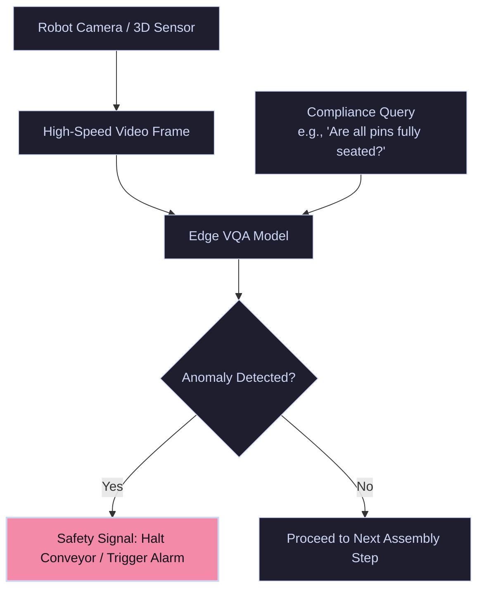

# Autonomous Edge Robotics & Industrial Inspection

In automated manufacturing, assembly, and robotics, VQA pipelines run on edge devices to perform diagnostic checks, detect anomalies, evaluate product compliance, and plan tasks.

---

## 🏛️ Edge Robotic VQA Loop

Camera sensors scan the assembly line or robotic space. The edge hardware runs visual inspection queries, evaluating parameters. If a defect is detected, the controller triggers safety logic or halts production.

---

## 🛠️ Key Applications & Systems

- **Industrial Assembly Compliance:** Running automated visual checks: `"Are all six copper pins fully seated in the plug?"`.
- **Embodied AI & Robotic Planning:** Robots asking VQA questions about their surroundings to formulate next steps (e.g., **RoboVQA** long-horizon reasoning).
- **Edge Deployment Optimization:** Quantizing VLM models (e.g., INT4/INT8 precision) to run inside low-power ARM devices on robotic platforms.
