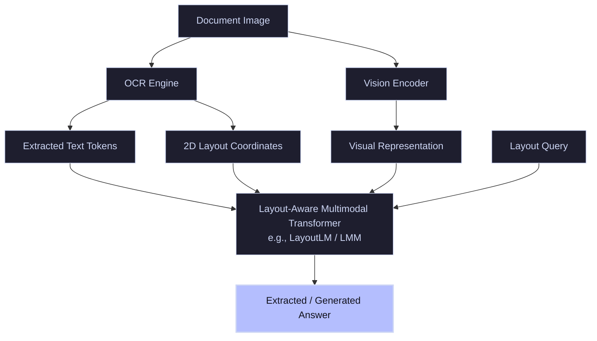

# Document VQA (DocVQA)

**Document Visual Question Answering (DocVQA)** is a specialized subfield of VQA focused on parsing information from text-dense images, corporate documents, PDFs, invoices, forms, charts, and table grids.

---

## 🏛️ System Architecture & Multimodal Processing

DocVQA architectures must merge three modalities: **Visual pixels**, **OCR text tokens**, and **2D spatial layout coordinates** (bounding boxes). The fusion is typically processed using layout-aware transformers (like LayoutLM).

---

## 🛠️ Key Challenges & Techniques

- **OCR Quality Dependency:** If the text recognition engine misidentifies figures or character symbols in small-font grids, the downstream reasoning layers cannot recover.
- **Complex Layout Parsing:** Document layouts often feature multiple columns, embedded tables, and footnotes, which challenge simple left-to-right reading orders.
- **Layout-Aware Embedding:** Utilizing 2D spatial embeddings to encode relative coordinates of words on the page, preserving document hierarchy.
