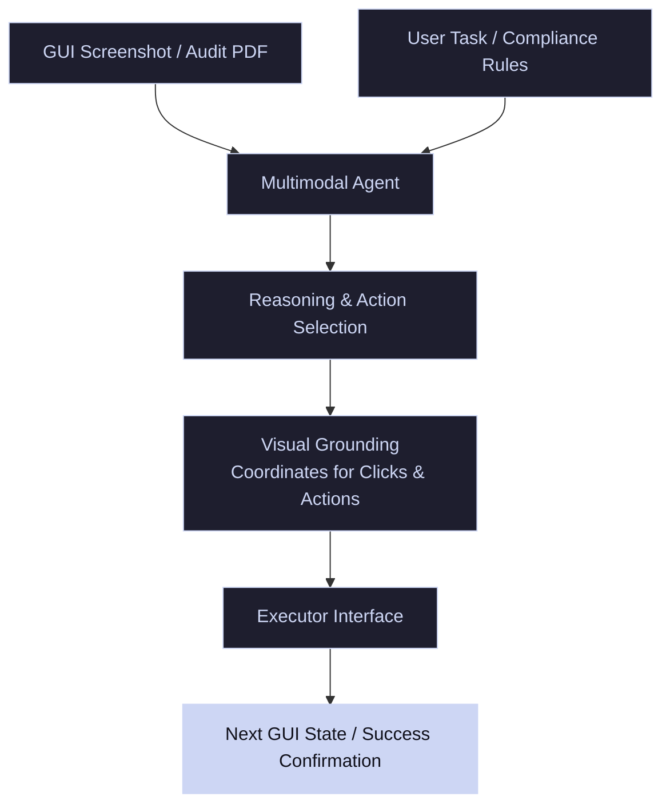

# Enterprise GUI & Document Auditing Agents

Enterprise environments rely on multimodal agents to process millions of documents (spreadsheets, schematics, invoices) and interact with graphical user interfaces (GUIs) to automate auditing and workflows.

---

## 🏛️ Agent Interaction & Auditing Pipeline

The agent takes a GUI screenshot or multi-page PDF, runs layout-aware VQA to verify compliance, and output actions (such as clicks, text inputs, or programmatic database entries) to execute tasks.

---

## 🛠️ Applications & Benchmarks

- **Multi-Modal Document Auditing:** Querying models with complex verification questions: `"Does the total listed in column C match the sum of lines 14-20?"`.
- **GUI Web Navigation:** Agents performing browser tasks (adding products to carts, filling out forms, auditing records) as benchmarked in **WebArena** and **VisualWebArena**.
- **Visual Grounding:** Mapping abstract text steps to physical coordinate clicks on custom-rendered application layouts.
