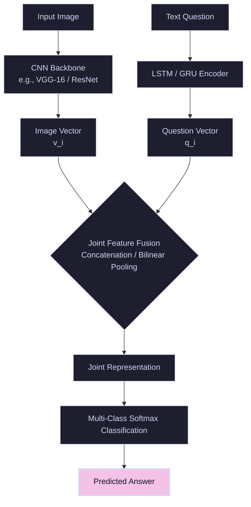

# Joint Feature Fusion Era (2015–2018)

The **Joint Feature Fusion** paradigm represents the foundational baseline of modern Visual Question Answering (VQA). In this era, VQA was framed primarily as a classification problem over a fixed, closed vocabulary of frequent answers.

---

## 🏛️ System Architecture

The core architecture uses two separate feature extraction backbones: a **Convolutional Neural Network (CNN)** for the input image and a **Recurrent Neural Network (LSTM)** or Gated Recurrent Unit (GRU) for the natural language question. The extracted feature arrays are fused together using a joint representation layer, followed by a multi-class classification head.

---

## 🛠️ Key Techniques & Fusion Modalities

To merge the disparate modalities of visual grids and sequential text tokens, researchers explored several fusion strategies:
1. **Simple Concatenation:** Appending the question vector directly to the global image vector: $[v_i; q_i]$.
2. **Element-wise Multiplication/Addition:** Fusing features through pointwise arithmetic operations.
3. **Bilinear Pooling (MCB / MFB / MFH):** Capturing fine-grained multiplicative interactions between all dimensions of the image and question features rather than simple linear combinations.

---

## ⚠️ Core Limitations

- **Language Bias:** Models frequently ignored visual content completely, relying on linguistic statistics in the training dataset (e.g., answering "yellow" to any question starting with "What color is the banana...").
- **Coarse Visual Encoding:** The use of global image vectors discarded spatial layout, leading to poor localization of objects.
- **Fixed Answer Vocabularies:** Restricting predictions to the top-K most common answers limited generalization to out-of-distribution questions.
