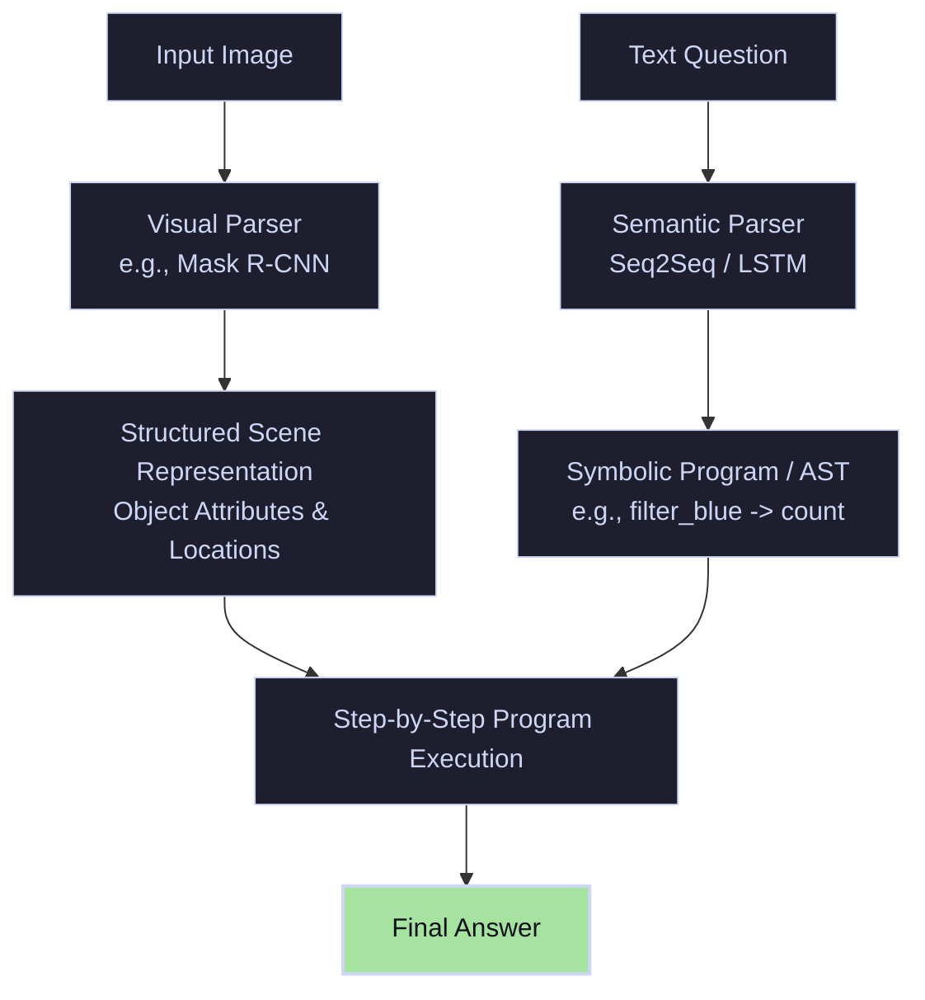

# Modular & Neuro-Symbolic Era (2018–2021)

To address the multi-step reasoning failures and language biases of early models, the VQA field shifted toward **Modular & Neuro-Symbolic** architectures. Instead of relying on monolithic end-to-end networks, these models decompose reasoning into structured, executable pipelines.

---

## 🏛️ System Architecture

A semantic parser (typically an LSTM or Transformer) translates the input question into a programmatic execution trace. Meanwhile, a vision backbone (like Mask R-CNN) parses the image into a symbolic representation (e.g., list of objects with attributes and spatial coords). Specialized, reusable neural modules then execute the parsed program step-by-step over the scene features.

---

## 🛠️ Key Techniques & Paradigms

1. **Neural Module Networks (NMNs):** Assembles a custom network topology dynamically for each question. Reusable sub-networks (modules) like `Find[object]`, `Relate[spatial]`, and `Compare[attribute]` are trained jointly.
2. **Scene Graphs:** Parsing the image into a graph structure where nodes represent objects (with attributes like color, size, material) and edges represent spatial relationships (e.g., `left of`, `inside`).
3. **Symbolic Program Execution:** Executing deterministic logic (like SQL or DSL programs) on the extracted scene representation, bypassing neural approximations in the final reasoning phase.

---

## ⚠️ Core Limitations

- **Fragility & Error Propagation:** If the semantic parser misidentifies the question structure, or the object detector fails to locate a key item, the entire downstream visual execution chain collapses.
- **Out-of-Vocabulary Issues:** Difficulty handling abstract concepts or relationships not represented in the closed-world Domain Specific Language (DSL).
- **High Annotation Cost:** Early methods required ground-truth program annotations for training the semantic parser.
