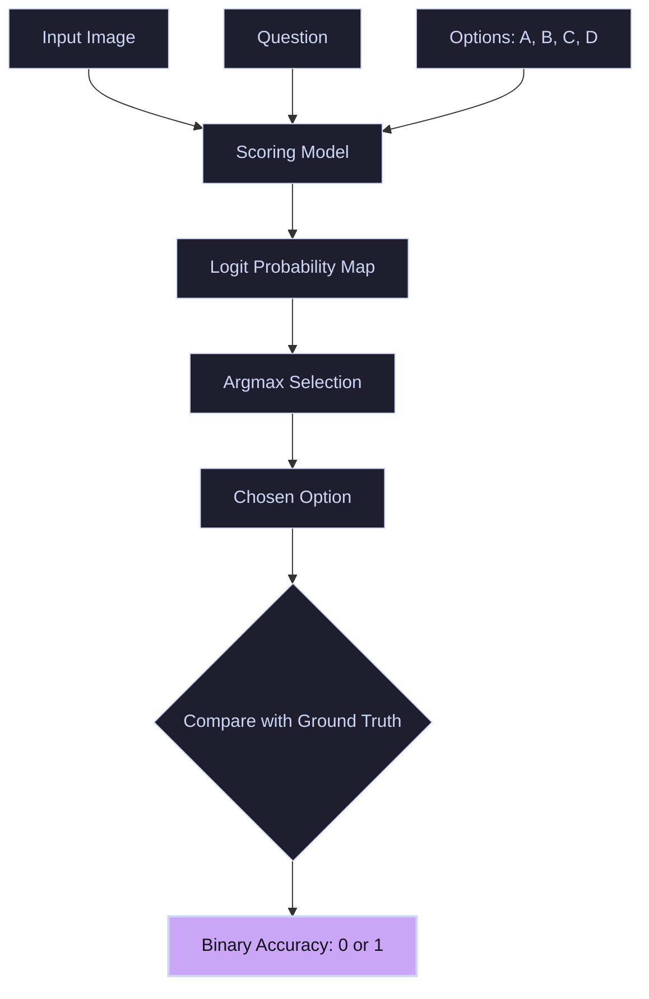

# Multiple-Choice VQA

**Multiple-Choice Visual Question Answering** structures VQA as a selection task. The system is provided with an image, a question, and a set of candidate options. The goal is to identify the single correct choice from the list.

---

## 🏛️ Flow & Evaluation Pipeline

The input query is processed alongside the visual features and candidate text options. The model evaluates each candidate (either by passing them through a scoring layer or comparing log-likelihoods) and selects the option with the highest probability.

---

## 🛠️ Advantages & Challenges

### Advantages
- **Ease of Evaluation:** Unlike open-ended generation, performance is measured using exact accuracy, avoiding lexical matching errors.
- **Controlled Vocabularies:** Prevents hallucinated or out-of-context text output.

### Challenges
- **Positional Bias:** Generative models often exhibit a preference for certain options (e.g., choosing "A" more frequently than other positions) regardless of content.
- **Guessing Strategy:** Models can exploit structural loopholes (like sentence length or formatting of the correct answer) to guess correctly without visual reasoning.
