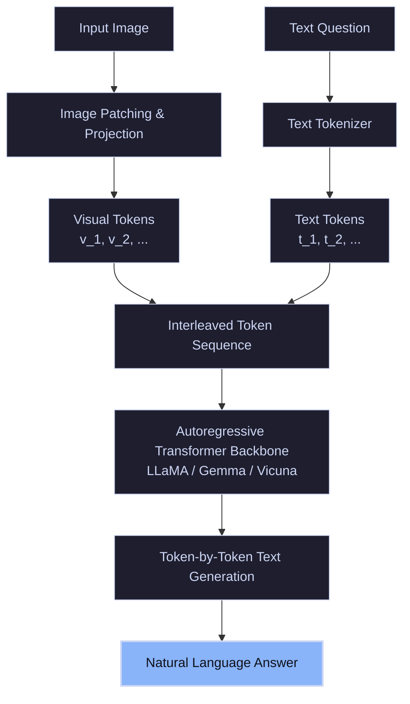

# Native Unified Generative VLM Era (2022–Present)

The current state-of-the-art paradigm in VQA is dominated by **Native Unified Generative Vision-Language Models (VLMs)**, also known as Large Multimodal Models (LMMs). Rather than fusing distinct text and vision models via classification heads, these models treat images as sequence patches interleaved natively with text tokens.

---

## 🏛️ System Architecture

Images are split into patches (e.g., $14\times14$ pixel grids) and projected into visual embeddings. Natural language questions are tokenized similarly. Both modal sequences are combined, interleaved, and fed into a massive autoregressive Transformer core (such as LLaMA or Vicuna), which generates the response token-by-token.

---

## 🛠️ Key Techniques & Innovations

1. **Linear Projection / Q-Former (BLIP-2):** Translating fixed-size image feature patches into the LLM's text token dimension.
2. **Visual Instruction Tuning:** Training VLMs using instruction-following datasets containing interleaved images and multi-turn conversations (pioneered by LLaVA).
3. **In-Context Learning:** Adapting to new VQA tasks on-the-fly without parameter updates, simply by prepending a few few-shot multimodal examples to the prompt (pioneered by Flamingo).

---

## ⚠️ Core Limitations

- **Hallucinations:** Large models occasionally construct facts, attributing details to the image that are not physically present.
- **Computational Cost:** High VRAM requirements for processing hundreds of visual patch tokens inside LLM context windows.
- **Resolution Bottleneck:** Standard vision encoders downsample images to fixed small resolutions, losing tiny details like small-font text or symbols.
