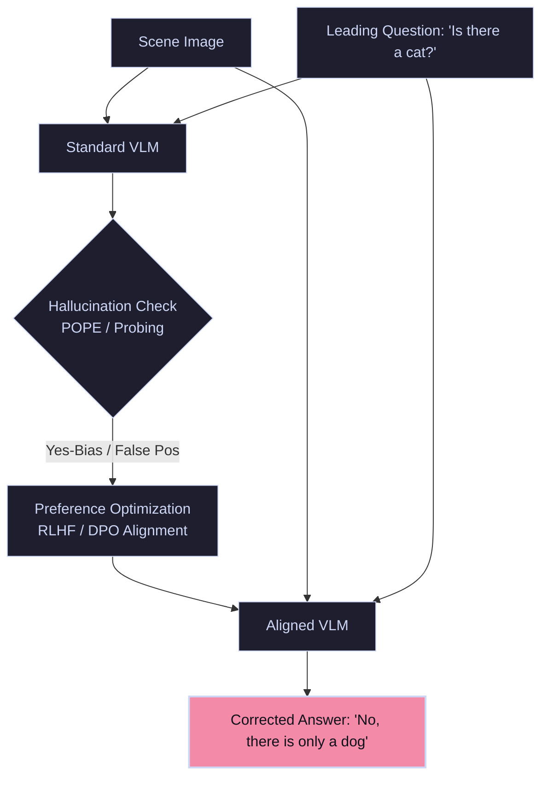

# Object Hallucination & Yes-Bias

Generative Vision-Language Models (VLMs) frequently hallucinate—asserting that objects exist in the scene when they are absent—due to strong language priors overriding visual visual cues. Models also suffer from **Yes-Bias**, answering "Yes" to leading questions.

---

## 🏛️ Evaluation & Mitigation Pipeline

We probe models using binary questions to detect hallucination rates, then align the VLM parameters using RLHF (Reinforcement Learning from Human Feedback) or DPO (Direct Preference Optimization) to penalize inaccurate assertions.

---

## 🛠️ Key Concepts & Mitigations

- **Object Hallucination:** Caused by visual-text misalignment or language models generating plausible sequences (e.g., hallucinating a laptop on an office desk because desks usually have laptops).
- **POPE (Polling-based Object Probing Evaluation):** Probing models with specific target objects (frequent, co-occurring, and random) using binary questions to extract clean precision/recall metrics.
- **DPO / RLHF:** Reinforcement training where the reward function penalizes answers that describe objects without corresponding coordinate regions in the image.
