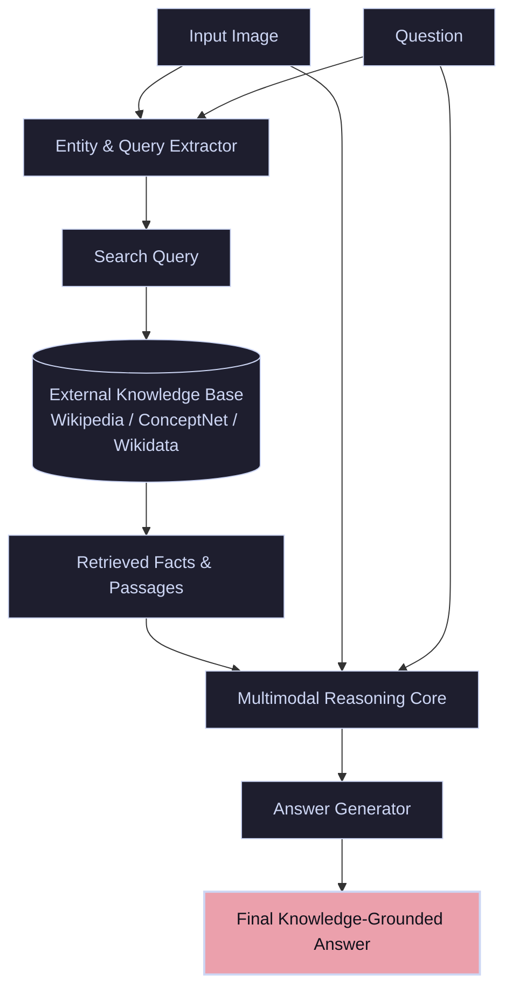

# Outside-Knowledge VQA (OK-VQA)

**Knowledge-Based or Outside-Knowledge Visual Question Answering (OK-VQA)** focuses on questions that cannot be resolved solely by parsing visual pixels; they require cross-referencing visual details with external facts, commonsense, or encyclopedic knowledge databases.

---

## 🏛️ System Architecture & Retrieval Pipeline

OK-VQA models usually deploy a **Retrieval-Augmented Generation (RAG)** pipeline. First, the image and question are processed to extract entities or search terms. These are queried against an external Knowledge Base (KB) such as Wikipedia or ConceptNet. The retrieved passages are fused with visual/text embeddings to generate the final response.

---

## 🛠️ Key Techniques & Paradigms

1. **Explicit Retrieval (RAG):** Querying external vector stores or search engines using text queries generated from image descriptions.
2. **Implicit Retrieval (Parametric Knowledge):** Relying on massive foundation Large Language Models (LLMs) which have encyclopedic facts memorized directly within their parameters.
3. **Multimodal Concept Mapping:** Aligning visual regions with semantic entities in knowledge graphs (e.g., linking a photo of a specific bird species to its habitat and diet information).
