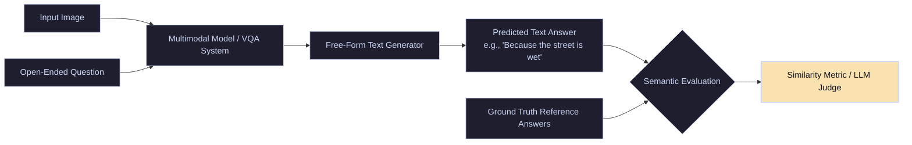

# Open-Ended VQA

**Open-Ended Visual Question Answering** represents the natural interface for VQA, where models are given an image and a free-form text question, and must output a natural language answer without being restricted to multiple-choice options or a fixed classification list.

---

## 🏛️ Flow & Evaluation Pipeline

The input query is processed alongside the visual features to generate a variable-length text output sequence. The predicted response is evaluated against ground-truth human answers using semantic and lexical similarity metrics.

---

## 🛠️ Critical Engineering & Evaluation Challenges

- **Lexical Diversity:** Different users may answer the same question in multiple correct ways (e.g., "automobile" vs. "car" vs. "sedan").
- **Automatic Metrics Limitations:** Standard NLP metrics (BLEU, ROUGE, METEOR) often penalize semantically identical answers due to minor vocabulary discrepancies.
- **LLM-as-a-Judge:** Modern pipelines leverage large models (like GPT-4) to grade open-ended answers based on semantic equivalence rather than exact string matches.
