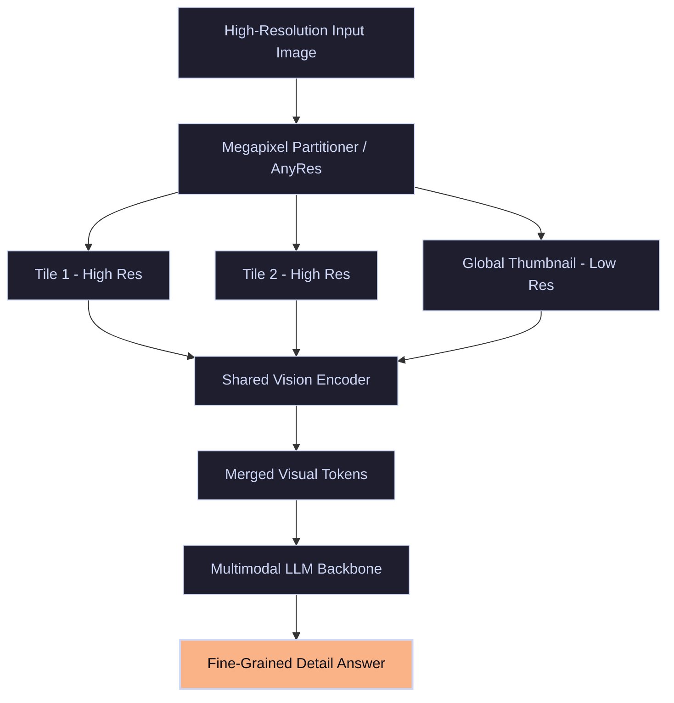

# The Spatial Resolution Blur Bottleneck

Traditional Vision-Language Models (VLMs) downsample high-resolution images to a small fixed size (e.g., $224 \times 224$ or $336 \times 336$ pixels) to fit memory constraints, which blurs out crucial details like tiny text, serial numbers, barcodes, or small objects.

---

## 🏛️ AnyRes / Dynamic Resolution Partitioning

To preserve fine details, modern architectures deploy **Dynamic Resolution Patching (AnyRes / Megapixel Partitioning)**. High-resolution images are sliced into standard-size tiles matching the image's aspect ratio, plus a downsampled global thumbnail, and processed concurrently.

---

## 🛠️ Key Techniques & Adaptations

1. **LLaVA-NeXT AnyRes:** Slices images dynamically into aspect-ratio aligned grids (e.g., $1\times2$ or $2\times2$ tiles).
2. **NaViT (Native Resolution ViT):** Pack-and-patch sequence processing to avoid resizing and padding entirely by packing multiple resolutions directly into standard batch lengths.
3. **Token Pruning / Merging:** Removing redundant background tokens from tiles to reduce LLM attention calculation overhead.
