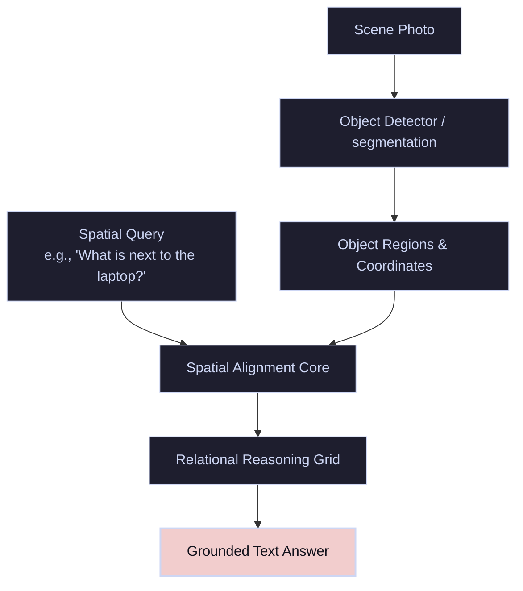

# Standard Scene VQA

**Standard Scene Visual Question Answering** targets natural, real-world photographs (e.g., indoor rooms, street layouts, outdoor landscapes). The questions typically evaluate the model's capacity for grounding objects, counting entities, describing traits, and identifying spatial relationships.

---

## 🏛️ Pipeline & Visual Grounding

The VQA core maps natural language question tokens to the spatial representations of objects detected inside a photographic scene. It resolves relative coordinates and spatial mappings to answer queries.

---

## 🛠️ Main Tasks

- **Attribute Recognition:** Identifying traits like colors, materials, and actions (e.g., `"What color is the shirt of the person riding the bicycle?"`).
- **Spatial Reasoning:** Mappings of absolute and relative positions (e.g., `"Is the coffee cup to the left of the keyboard?"`).
- **Counting:** Identifying the exact quantity of specific objects in cluttered scenes (e.g., `"How many cars are parked on the side of the road?"`).
