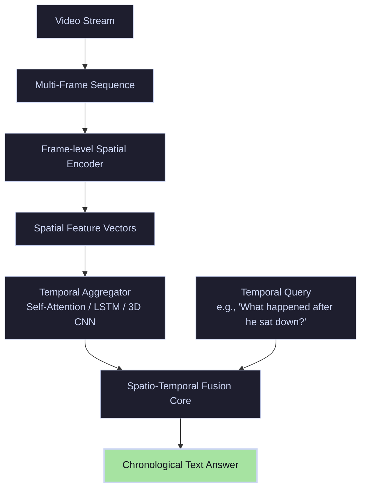

# Video Question Answering (VideoQA)

**Video Question Answering (VideoQA)** extends VQA by adding a temporal dimension. Instead of analyzing a static single image, models must ingest sequences of video frames to track events, activities, trajectories, and cause-and-effect relationships over time.

---

## 🏛️ System Architecture & Temporal Modeling

VideoQA models process video frames sequentially. Individual frame spatial features are extracted using 2D CNNs or Vision Transformers, then aggregated temporally using recurrent units, 3D convolutions, or temporal self-attention.

---

## 🛠️ Key Capabilities & Tasks

- **Temporal Grounding:** Identifying the exact start and end times of specific actions (e.g., `"When did the cat jump off the table?"`).
- **Causal Reasoning:** Determining cause-and-effect paths (e.g., `"Why did the window break at the 10-second mark?"`).
- **Action Sequence Tracking:** Describing ordered operations (e.g., `"What did the chef add to the bowl first?"`).
